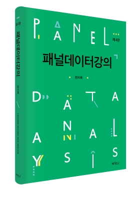

# 패널데이터강의

저자: 한치록 
연도: 2014년 
출판사: [박영사](https://www.pybook.co.kr/mall/book/field?goodsno=2460&ssort=&category=0304)

데이터는 [data](data) 디렉토리, do 파일들은 [codes](codes) 디렉토리에 있음

## 제4판 서문

제4판에서는 최근의 연구 동향을 반영하여 정책도입의 지연(staggered
adoption)과 정책효과 이질성이 결합하여 나타나는 문제에 대한 논의와
예제를 4.3절에 추가하고, 합성 이중차분법(Synthetic DID)에 관한 논의와
예제를 4.4절에 추가하였다. 또한 기후와 경제성장의 관계를 살펴본 Burke,
Hsiang, and Miguel (2015, *Nature*) 논문 예제를 4.5절에
포함시켰다. 그 외에도 FD 회귀에서 제곱항이 있을 때 Stata가 명령을
처리하는 방식과 관련된 특이한 혼동사항을 처리하였고(예제 3.5), 5.3절
Bartik 도구변수에 관한 논의를 더 정리하였으며, 전체적으로 서술을
다듬었다. 데이터 저장소는 초판 서문에 있다.

용어 면에서 ‘2중 클러스터 표준오차’를 ‘two-way’라는 표현에 더 가깝게
‘양방향 클러스터 표준오차’로 바꾸었다. 기호 측면에서 고정효과 모형은
$\alpha + \mu_i$를 $\alpha_i$라 하고 모형을 $y_{it} = \alpha_i +
X_{it}\beta + \varepsilon_{it}$로 쓰는 경우도 많다. 독자들이
$\alpha_i$ 표현에 좀 더 익숙해지도록 고정효과 모형의 경우 $\alpha_i$
표현을 약간 더 사용하였다. 조판 측면에서 Stata의 버전이 바뀌면서
`xtset` 명령의 출력에 빈 줄이 추가되여 행 번호가 전체적으로 뒤로
밀리는 곤란한 일이 발생하였다. 앞으로도 Stata 버전이 바뀜에 따라 이런
일이 또 생길 것을 대비하여 이번 기회에 아예 빈 줄에는 번호를 매기지
않는 식으로 바꾸어 버렸다. Stata의 사소한 변화에 대해 이 책이 더
견고해졌기를 바란다.

다양한 흥미로운 문제들을 제기해 준 독자 여러분, 학생들, 동료교수들께
고마운 마음을 전한다. 4판 출판을 위해 수고해 주신 박영사 여러분과 많은
성원을 보내 주신 독자들에게도 깊이 감사드린다.

2014년 1월 
한치록

## 목차

**제1장 준비**:
1.1 패널 데이터,
1.2 계량경제학 기초,
1.3 계량경제 소프트웨어 Stata,
1.4 패널 데이터 저장 방법

**제1부 선형 정태적 패널 모형**

**제2장 임의효과 모형**:
2.1 선형 패널모형의 기초,
2.2 통합최소제곱 회귀,
2.3 임의효과 모형,
2.4 임의효과 회귀,
2.5 임의효과 존재 여부의 검정,
2.6 최우추정법,
2.7 선형 PA 모형의 GEE 추정

**제3장 고정효과 모형**:
3.1 집단간 회귀,
3.2 고정효과 모형,
3.3 1계차분 회귀,
3.4 고정효과 회귀,
3.5 더미변수 회귀,
3.6 계수의 해석과 모형 비교,
3.7 상관된 임의효과,
3.8 고정효과 대 임의효과 검정,
3.9 Hausman과 Taylor의 모형

**제4장 정태적 모형의 심화 주제들**:
4.1 네 가지 R제곱,
4.2 시계열 변수와 시간더미,
4.3 이중차분법,
4.4 합성통제,
4.5 개체별로 상이한 계수를 갖는 변수들을 통제하기,
4.6 고정효과 모형에서 제곱항,
4.7 고정효과 회귀와 더미 상호작용,
4.8 이분산, 횡단면 종속, 시계열 상관의 검정

**제5장 도구변수 추정**:
5.1 집단내 회귀와 집단간 회귀의 도구변수 추정 표현,
5.2 내생적 설명변수와 도구변수 추정,
5.3 Bartik 도구변수,
5.4 과거 정보를 도구변수로 사용하는 방법,
5.5 우변에 종속변수의 과거값이 있는 모형

**제2부 선형 동태적 패널 모형**

**제6장 선형 동태적 패널모형과 추정**:
6.1 선형 동태적 모형과 계수의 해석,
6.2 Anderson and Hsiao의 도구변수 추정,
6.3 차분적률법,
6.4 시스템적률법,
6.5 모형설정 검정

**제7장 동태적 패널모형의 심화 주제들**:
7.1 동태적 패널모형 고정효과 회귀의 편향,
7.2 정상성 가정하의 추정,
7.3 임의효과 동태패널 모형,
7.4 동태적 모형을 이용한 내생성 문제의 해결,
7.5 Stata 명령에 관한 주석

**제3부 비선형 모형과 심화 주제들**

**제8장 이항반응모형과 여타 모형들**:
8.1 모집단 평균 모형,
8.2 임의효과 이항반응 모형,
8.3 동태적 이항반응 임의효과 모형,
8.4 고정효과 로짓 모형,
8.5 여타 모형들

**제9장 표본선택과 표본이탈**:
9.1 패널 데이터에서 표본선택과 표본이탈,
9.2 전체 불균형패널과 균형화한 부분패널의 분석,
9.3 선택편향의 검정,
9.4 표본선택으로 인한 편향의 교정,
9.5 표본이탈의 문제

**제10장 시계열 주제와 횡단면 종속**:
10.1 패널 VAR,
10.2 패널 단위근,
10.3 횡단면 종속과 공간 패널 모형,
10.4 요인 모형

**부록**

A 연습문제 풀이

B 보론:
B.1 패널 데이터에서 외생성과 내생성,
B.2 클러스터 표준오차,
B.3 겉보기에 상관없는 회귀식들(SUR),
B.4 상이한 개체 간의 상호의존성,
B.5 횡단면 분석에서 이항반응 모형,
B.6 횡단면 분석에서 표본선택,
B.7 부트스트랩,
B.8 공간계량경제학,
B.9 공통요인 추출과 주성분 분석

C 적률법:
C.1 일반화된 적률법,
C.2 선형 횡단면 데이터 모형에서 GMM,
C.3 적률조건 타당성의 검정,
C.4 동태적 패널 모형의 차분적률법

D 수학적 증명과 도출:
D.1 설명변수가 동일할 때 SUR과 개별 OLS의 동일성,
D.2 RE 추정을 위한 변환식의 도출,
D.3 POLS 오차 분산 추정량의 극한,
D.4 1계차분 GLS 추정량과 FE 추정량의 동일성,
D.5 LSDV 회귀와 FE 회귀의 동일성,
D.6 FE 로짓 추정량의 도출

참고문헌 
찾아보기

